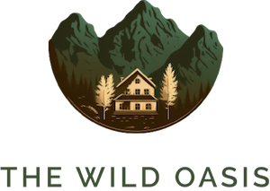
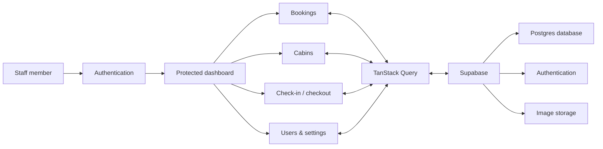

<div align="center">
  

  # The Wild Oasis

  **A full-featured hotel operations dashboard for managing cabins, bookings, guests, and day-to-day stays.**

  Built as the internal management platform for The Wild Oasis — with a guest-facing booking experience coming next.

  <p>
    
    
    
    
  </p>

  **[Live Demo](https://the-wild-oasis-vert-psi.vercel.app)** · **[Guest Website — in development](#roadmap)**

  ### Demo Login

  Email: demo@example.com
  Password: demo-password
  
  Feel free to explore the dashboard, bookings, cabins, and other features.
  </div>

---

## About the project

The Wild Oasis is a private, staff-facing hotel management application. It brings the property's most important workflows into one place: employees can monitor performance, manage cabin inventory, review reservations, check guests in and out, and configure hotel-wide booking rules.

The application uses **Supabase** for its database, authentication, and file storage, while **TanStack Query** manages remote state, caching, mutations, and cache invalidation in the client.

> This repository contains the **hotel operations dashboard**. A separate guest-facing frontend for browsing cabins and making reservations is planned.

## Highlights

- **Secure staff access** — authenticated routes, persistent sessions, login/logout, and protected application screens
- **Operations dashboard** — sales, occupancy, booking, and stay metrics with configurable date ranges
- **Data visualization** — revenue and stay-duration charts powered by Recharts
- **Booking management** — filter, sort, paginate, inspect, and delete reservations
- **Guest check-in and checkout** — record payments, confirm breakfast options, and update stay status
- **Cabin inventory** — create, edit, duplicate, and remove cabins with image uploads
- **User administration** — create staff accounts and manage user profiles
- **Hotel settings** — update pricing, minimum/maximum stay length, and maximum guests per booking
- **Responsive feedback** — loading states, error boundaries, confirmation dialogs, and toast notifications
- **Dark mode** — persistent light and dark themes using a dedicated context layer

## Application flow



## Tech stack

| Layer | Technology |
| --- | --- |
| UI | React 19, Styled Components, React Icons |
| Build tooling | Vite 8, ESLint, Prettier |
| Routing | React Router |
| Server state | TanStack Query |
| Forms | React Hook Form |
| Backend services | Supabase Database, Auth, and Storage |
| Charts | Recharts |
| Dates | date-fns |
| UX | React Hot Toast, React Error Boundary |

## Getting started

### Prerequisites

- [Node.js](https://nodejs.org/) 20 or newer
- npm
- A Supabase project with the required tables, authentication, and storage bucket

### Installation

```bash
git clone <your-repository-url>
cd the-wild-oasis
npm install
npm run dev
```

Vite will print the local development URL in your terminal, typically `http://localhost:5173`.

### Supabase configuration

The Supabase client is initialized in `src/services/supabase.js`. To connect your own project, replace the project URL and anonymous key with the values from your Supabase project settings.

The browser must only receive a Supabase **anonymous/publishable key**. Never expose a service-role key in client-side code. Row Level Security policies should be enabled to protect production data.

## Available scripts

| Command | Purpose |
| --- | --- |
| `npm run dev` | Start the Vite development server |
| `npm run build` | Create an optimized production build |
| `npm run preview` | Preview the production build locally |
| `npm run lint` | Run ESLint across the project |

## Project structure

```text
src/
├── context/       # Global theme state
├── data/          # Development seed data and cabin assets
├── features/      # Domain modules: bookings, cabins, auth, dashboard...
├── hooks/         # Shared custom React hooks
├── pages/         # Route-level components
├── services/      # Supabase queries and mutations
├── styles/        # Global application styles
├── ui/            # Reusable interface components
└── utils/         # Constants and helper functions
```

The codebase follows a **feature-based architecture**: domain-specific components and hooks live together, while reusable primitives remain in `ui`. Supabase calls are isolated in the service layer, keeping data access separate from presentation.

## Deployment

The dashboard is intended to be deployed on **Vercel**.

1. Import the repository into Vercel.
2. Keep the framework preset set to **Vite**.
3. Use `npm run build` as the build command and `dist` as the output directory.
4. Add a SPA rewrite so direct visits to protected routes are served by `index.html`.
5. Deploy, then replace the “Live Demo” placeholder at the top of this README with the production URL.

> **Deployment status:** Not deployed yet — Vercel link coming soon.

## Roadmap

- [x] Staff authentication and protected routes
- [x] Analytics dashboard
- [x] Cabin and booking management
- [x] Check-in and checkout workflows
- [x] User account and hotel settings
- [x] Dark mode
- [ ] Deploy the management dashboard to Vercel
- [ ] Build the guest-facing website
- [ ] Connect guest reservations to the existing Supabase backend
- [ ] Add automated test coverage

## Project status

The core management experience is functional and actively being refined. The next major phase is the public-facing frontend, which will allow guests to explore cabins, manage their profiles, and create reservations against the same backend.

---

<div align="center">
  <sub>Built with React and Supabase for modern hotel operations.</sub>
</div>
